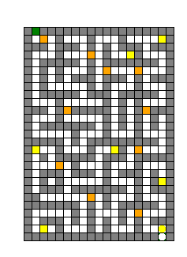

# Quete_chateau_python

## Niveau 1 : construction et affichage du plan du château. 

Ce niveau consiste à tracer correctement le plan du château à partir du fichier de données. La gestion du jeu après affichage du plan ne fait pas partie de ce niveau.

## Niveau 2 : gestion des déplacements.  

Le personnage sera représenté par un petit rond (fonction prédéfinie turtle.dot). Il pourra se déplacer case par case dans les 4 directions (haut, bas, droite, gauche).

Lorsque le personnage tentera un déplacement vers une case de mur ou vers l’extérieur du plan, rien ne se produira.

Lorsqu’il tentera un déplacement vers une case vide, il avancera d’une case (en pratique, il s’agira de retracer la case de départ pour effacer le personnage, et de replacer ce dernier sur la case de destination).

## Niveau 3 : collecte d’objets dans le labyrinthe

la gestion des objets, présents dans le château, que le personnage collecte quand il passe sur la case correspondante. 

Reste à implémenter : 

La fonction de lecture des questions, l'affichage du texte 

## Aperçu du jeux 

